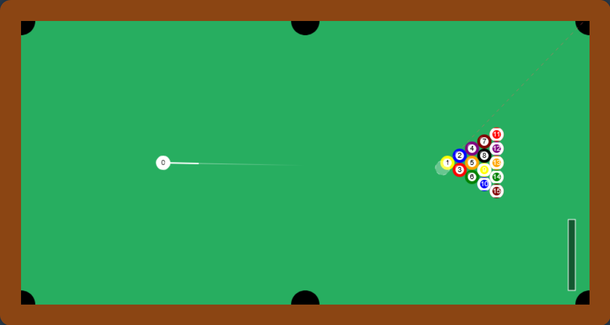

# Web-Based Pool Game

A modern, interactive pool game built with vanilla JavaScript and HTML5 Canvas. Features realistic physics, AI opponent, and intuitive controls.

 *(You may want to add a screenshot of your game)*

## Features

- 🎱 Realistic pool physics and ball collisions
- 🎯 Intuitive aiming system with trajectory prediction
- 🤖 AI opponent with strategic shot planning
- 🎮 Power control system with visual feedback
- 🔊 Immersive sound effects
- 💻 Pure JavaScript implementation - no external dependencies

## Controls

- **Mouse Movement**: Aim the cue
- **Left Click (Hold)**: Charge shot power
- **Left Click (Release)**: Take shot
- **Space Bar**: Hold to set power manually
- **Arrow Up**: Increase shot power
- **Arrow Down**: Decrease shot power
- **R Key**: Show robot's predicted shot
- **Tab**: Focus game canvas for keyboard controls

## Getting Started

### Prerequisites

- A modern web browser with HTML5 Canvas support
- Local web server (recommended for sound effects)

### Installation

1. Clone the repository or download the files
2. If using Visual Studio Code, install the "Live Server" extension
3. Right-click `index.html` and select "Open with Live Server"

Alternatively, you can use any local web server:
```bash
# Using Python 3
python -m http.server

# Using Node.js
npx http-server
```

## Project Structure

```
Pool/
├── index.html          # Main game HTML
├── game.js            # Game logic and physics
├── styles.css         # Game styling
└── sounds/            # Sound effects
    ├── ballscollide.wav
    ├── hole.wav
    ├── side.wav
    └── strike.wav
```

## Technical Details

### Physics Implementation

- Elastic collision detection and response
- Velocity-based movement system
- Friction simulation
- Wall and pocket collision detection


## Browser Compatibility

Tested and working in:
- Firefox (Recommended)
- Chrome
- Edge
- Safari

## Contributing

Feel free to open issues or submit pull requests for:
- Bug fixes
- New features
- Performance improvements
- Documentation updates

## License

This project is open source and available under the MIT License.

## Acknowledgments

- Sound effects sourced from various free sound libraries
- Physics calculations based on standard pool/billiards mechanics
- Inspired by classic pool games and modern web technologies
